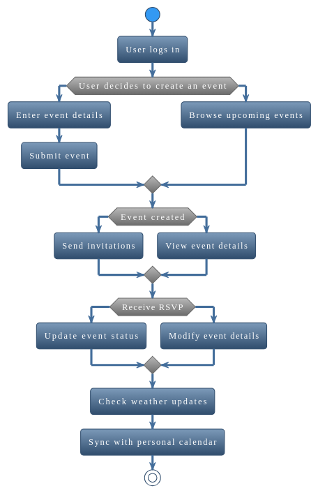

## Eventplanner

### Content
- [Introduction](#introduction)
- [Product statement-vision](#product-statement-and-vision)
- [Product features-functionalities](#product-features-and-functionalities)
- [Non-Functional requirements](#non-functional-requirements)
- [Product backlog](#product-backlog)
- [Project Roadmap](#project-roadmap)
- [Activity overview](#activity-overview)
- [User journey](#user-journey)
- [User story](#user-stories)
- [User persona](#user-persona)

#### Introduction

   The main purpose of this document is to provide a high level overview on the Eventplanner project, it's features and
it's main objective. 
   This project aims to provide the user with a comprehensive solution which simplifies the process of creating and 
attending to different events. The application integrates personalize features such as event creation, invitation, 
personal preferences, weather updates/situation and a personalized calendar.
   
The main objectives of the application are:
 - Simplifying Event Mangement
 - Focus on User Experience
 - Personalization 
 - Scalability and reliability

#### Product statement and vision
   Eventplanner as an application came out as a solution due to multiple problems. Some of them would be fragmentation
of event planning and information across many individuals, a decentralized place for common information regarding event
discovery, lack of personalization in user experience and difficulties in event management.
   Our solution aims to solve these problems by creating a comprehensive, user-centric, centralized event management
application. The application will serve as main point in event management and planning.

#### Product features and functionalities
   As an all-in-one event planner and management solution, out application propose a large set of features and 
functionalities in order to provide a seamless and intuitive platform which caters to the large range of needs
of event organisers and attendees.
- Event Creation
     - Users can create events, specifying essential details such as the event name, date, time, and location.
     - Options to add additional information like event descriptions, categories etc
 - Invitation Management
     - Ability to send digital invitations to friends, colleagues, or a broader audience.
     - Features to customize invitation templates and track responses (RSVPs).
 - RSVP tracking
     - Functionality for invitees to respond to invitations, confirming or declining attendance.
     - Real-time updates to the event organiser on the status of invitations and attendee list.
 - Personal preferences
     - Users can set and modify their preferences for event types, locations, and time frames.
     - The application uses these preferences to recommend relevant events to users.
 - Event discovery and recommendations
     - A dynamic discovery feature that suggests events based on user preferences, past attendance, and popular trends.
     - Options for users to explore events by categories, dates, or locations
 - Weather Information
     - Real-time weather updates and forecasts for event locations.
     - Notifications to users about weather conditions on the day of the event, aiding in planning and preparation.
 - Personal Calendar     
     - Integration with users’ personal calendars to automatically update with their event schedules.
     - Reminders and notifications for upcoming events to ensure users are well-prepared.
 - Customized notifications
     - Personalized alerts for event changes, reminders, invitations, and weather updates.
     - Adjustable notification settings to suit user preferences.
 - Feedback and rating
     - After-event features for attendees to rate and provide feedback on events.
     - Insights for organisers to gauge the success of their events and areas for improvement.

#### Non-functional requirements
   The non-function specifications guarantee that the program fulfills its functional goals and provides
   a dependable, safe, and effective user experience. The application's non-functional requirements are:
 - Performance
   - SLO: The application should have an average response time of less than 2 seconds under normal load conditions.
   - SLI: Guaranteed uptime of 99.5% 
 - Usability 
   - SLO: Achieve a user satisfaction score of at least 85% in usability surveys
 - Scalability
   - SLO: The system should efficiently handle a 50% increase in user traffic without impacting performance metrics.
 - Compliance and Standards
   - SLO: Full compliance with GDPR
#### Product backlog
   In order to have a clear overview of feature, task and requirement, based on importance and impact to project 
   success, a backlog list is necessary.
- User Account Management 
   - Registration and login functionality
   - Profile creation and editing
   - Password recovery
   - Event Creation and Management
   
- Interface for creating new events
   - Options to edit and delete events
   - Calendar integration for event scheduling
   - Venue Selection
   
- Database of venues with filters (location, capacity, etc.)
   - Venue booking functionality
   - Integration with maps for venue location
   - Invitations and Guest Management
   
- Sending electronic invitations
   - Tracking RSVPs
   - Managing guest lists

- Notification System 
   - Email and in-app notifications for event updates
   - Reminders for important dates and tasks
#### Project Roadmap
   In order to outline the key stages and have a milestone planning a project roadmap
diagram is recommended.

#### Activity overview
   In order to have a better understanding of the flow an activity diagram is provided.The Activity Diagram provides 
   a visual representation of the workflow associated with the event management process within our application

   

#### User Journey
   In order to provide a better image about user's journey, a user journey map diagram is essential. The User Journey 
   Map is a graphical illustration that captures the complete experience of a user, from initial contact with the 
   application through various stages of interaction to the final goal achievement.
  
 

#### User-Stories
 - As an event organizer, I want to easily create events, so that I can share them with potential attendees.
 - As a user, I want to invite friends and colleagues to my events, so that I can organize gatherings efficiently.
 - As an invitee, I want to receive event invitations and respond to them, so that I can manage my attendance.
 - As a user, I want to set my personal preferences for events, so that the app can recommend events that interest me.
 - As a user, I want to view a list of upcoming events tailored to my interests,
so that I can decide which events to attend
 - As an event attendee, I want to receive weather updates for the events I plan to attend, 
so that I can prepare accordingly.
 - As a user, I want to synchronize my personal calendar with the app, so that I can manage my schedule effectively.
 - As a user, I want to receive customized notifications about events, so that I stay informed about any 
changes or updates.
 - As an event organizer, I want to receive feedback on my events, so that I can improve future events.

#### User Persona

To effectively design and develop the Event Management Application, it's crucial to have a clear understanding
of the typical users. Below is a detailed user persona that represents a segment of the
application's target audience:

   Persona: Emily Nguyen 
- Demographics:
  - Age: 29
  - Occupation: Marketing Manager
  - Location: Urban City
  - Education: Bachelor's degree in Marketing
  - Marital Status: Single

- Psychographics:
  - Lifestyle: Active social life, enjoys attending and organizing events.
  - Personality: Outgoing, organized, tech-savvy.
  - Values: Efficiency, connectivity, work-life balance.
  - Hobbies: Networking, traveling, music festivals.

- Technology Usage: 
  - Comfortable with technology and frequently uses mobile apps for social and professional purposes.
  - Prefers applications that are intuitive and save time.

- Goals and Motivations: 
  - To efficiently organize and manage professional and personal events.
  - To discover new events that align with her interests.
  - To maintain a balanced and organized schedule.
- Pain Points: 
  - Difficulty in finding events that match her interests.
  - Managing invitations and RSVPs across multiple platforms.
  - Keeping track of various events in her busy schedule.

- Interaction with the App: 
  - Uses the app to create and manage both professional networking events and personal gatherings.
  - Relies on the app for discovering new events, especially those related to her professional growth and personal interests.
  - Appreciates the personalized event recommendations and weather updates.
  - Values the integration with her personal calendar for better schedule management.

- How the App Helps Emily:
  - Event Creation and Management: Emily can easily create and manage her events, streamlining her planning process.
  - Personalized Recommendations: The app suggests events based on her preferences, helping her discover relevant professional and social gatherings.
  - Integrated Calendar: With the app syncing with her personal calendar, Emily can efficiently manage her schedule without conflicts.
  - Weather Updates: She can plan her event attire and logistics according to the weather forecasts provided by the app.

[//]: #(https://showme.redstarplugin.com/s/s:tkwtNwO8)