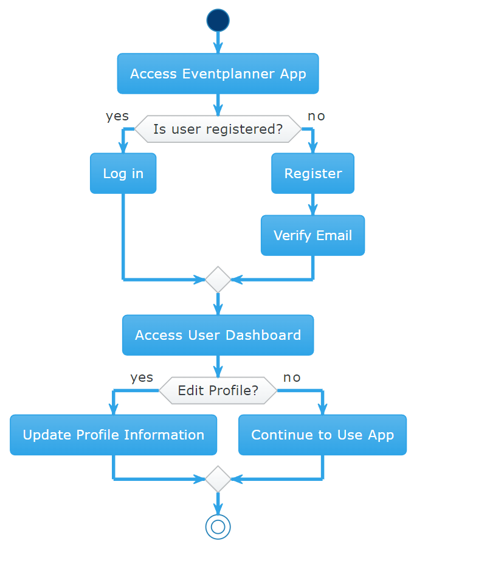

## Eventplanner

### Content

- [Introduction](#introduction)
- [Product statement-vision](#product-statement-and-vision)
- [Non-Functional requirements](#non-functional-requirements)
- [Product features and functionalities](#product-features-and-functionalities)
- [Product backlog](#product-backlog)
- [Project Roadmap](#project-roadmap)
- [Activity overview](#activity-overview)
- [User journey](#user-journey)
- [User story](#user-stories)
- [User persona](#user-persona)

#### Introduction

The main purpose of this document is to provide a high level overview on the Eventplanner project, it's features and
it's main objective.
This project aims to provide the user with a comprehensive solution which simplifies the process of creating and
attending to different events. The application integrates personalize features such as event creation, invitation,
personal preferences, weather updates/situation and a personalized calendar.

The main objectives of the application are:

- Enhanced Collaboration for Organizers
  - Facilitate seamless collaboration among event organizers by providing features that enable easy sharing of event details and coordination.
  - Offer collaborative tools for multiple organizers to contribute to event planning, ensuring a unified and well-coordinated approach.
- Efficient Communication Channels
  - Implement efficient communication channels within the application to foster better interaction between event organizers and attendees.
  - Provide real-time updates features to enhance communication regarding event details, changes, and important announcements.
- Accessibility and Inclusivity
  - Implement design and functionality considerations that cater to a wide range of users, promoting inclusivity in event participation.

#### Product statement and vision

Eventplanner as an application came out as a solution due to multiple problems. Some of them would be fragmentation
of event planning and information across many individuals, a decentralized place for common information regarding event
discovery, lack of personalization in user experience and difficulties in event management.
Our solution aims to solve these problems by creating a comprehensive, user-centric, centralized event management
application. The application will serve as main point in event management and planning.

#### Non-functional requirements

As an all-in-one event planner and management solution, out application propose a large set of features and
functionalities in order to provide a seamless and intuitive platform which caters to the large range of needs
of event organisers and attendees.

- Performance

  - Response Time

    - The application should achieve an average response time of less than 2 seconds for key user interactions, such as event creation, invitation sending, and RSVP tracking.
    - Specific actions, like loading event details or updating preferences, should have response times within milliseconds to ensure a snappy user experience.

  - Scalability
    - The system should maintain the specified response time even under a 50% increase in concurrent user traffic.

- Database Scalability

  - The database architecture should scale horizontally to accommodate a growing volume of event data without compromising query response times.
  - The database system should efficiently handle CRUD operations, ensuring optimal performance for Create, Read, Update, and Delete actions.

- Usability

  - User Satisfaction (SLI)

    - Conduct regular usability surveys to gauge user satisfaction, aiming for a score of at least 85%.
    - Actively gather user feedback and implement iterative improvements to enhance overall usability.

  - Accessibility (SLO)
    - Maintain compliance with Web Content Accessibility Guidelines (WCAG), ensuring accessibility for users with diverse needs.
    - Conduct quarterly accessibility testing to verify ongoing adherence to standards.

- Compliance and Standards

  - GDPR Compliance (SLO)
    - Ensure full compliance with the General Data Protection Regulation (GDPR) standards.
    - Implement robust data protection measures, including user consent mechanisms, data encryption, and the right to erasure.
    - Conduct annual GDPR compliance audits to verify ongoing adherence.

- Database Operations

  - CRUD Functionality
    - The database system should support CRUD operations (Create, Read, Update, Delete) for efficient management of event-related data.
    - Data integrity and consistency should be maintained throughout all database transactions.

- Compatibility
  - Ensure optimal performance and compatibility of the web application across various browsers. Focus on maintaining consistent functionality and performance across different devices, including those operating on Windows systems.

#### Product features and functionalities

The Eventplanner application encompasses a range of features and functionalities designed to streamline the event planning and management process. These features are structured to align with the project's vision and address the needs of both event organizers and attendees.
Features:

- User Account Management: Registration, login, profile management
- Event Creation and Editing: Interface for creating and editing events, including title, description, date, and time.
- Invitations and Guest Management: Electronic invitations, RSVP tracking, and guest list management.
- Notification System: In-app notifications for event updates and reminders.
- Personalized Event Recommendations: Tailored suggestions based on user preferences and interests.
- Calendar Integration: For efficient schedule management.
- Weather Updates: Real-time weather information for event locations.
- Collaboration Tools: Features for multiple organizers to work together on a single event.

Integration Points
Calendar Applications: For syncing event dates and reminders.
Weather Services: To provide accurate weather forecasts for event days.

#### Product backlog

In order to have a clear overview of feature, task and requirement, based on importance and impact to project
success, a backlog list is necessary.

- User Account Management
  - Registration and login functionality
  - Profile creation and editing
  - Event Creation and Management
- Interface for creating new events
  - Options to edit and delete events
  - Calendar integration for event scheduling
- Sending electronic invitations

  - Tracking RSVPs
  - Managing guest lists

- Notification System
  - Email and in-app notifications for event updates
  - Reminders for important dates and tasks

Registration and Login Functionality
-Given a user wants to access personalized features, when they visit the app, then they should be able to register or log in.
-Linked to User Story: "As a user, I want to set my personal preferences for events..."
-Sprint 1 Inclusion: Yes

Profile Creation and Editing
-Given a user needs to update their information or preferences, when they access their account, then they should be able to edit their profile.
-Sprint 1 Inclusion: Yes

Given an organizer needs to change event details or cancel an event, when they access their event, then they should be able to edit or delete it.
-Linked to User Story: "As an event organizer, I want to easily create events..."
-Sprint 1 Inclusion: Yes

Calendar Integration for Event Scheduling
-Given a user wants to manage their schedule, when they create or RSVP to an event, then the event should be integrated into their personal calendar.
-Linked to User Story: "As a user, I want to synchronize my personal calendar..."
-Sprint 1 Inclusion: No (Future Sprint)

Invitations and Guest Management
-Given an organizer has created an event, when they want to invite guests, then they should be able to send electronic invitations.
-Linked to User Story: "As a user, I want to invite friends and colleagues..."
-Sprint 1 Inclusion: Yes

Tracking RSVPs
-Given an organizer has sent invitations, when guests respond, then the organizer should be able to track RSVPs.
-Sprint 1 Inclusion: Yes

Managing Guest Lists
-Given an organizer is managing their event, when they view the event details, then they should be able to see and manage the guest list.
-Sprint 1 Inclusion: Yes

Notification System
-Given there is an update or change in event details, when this occurs, then attendees should receive notifications.
-Linked to User Story: "As an event attendee, I want to receive weather updates..."
-Sprint 1 Inclusion: Yes

#### Project Roadmap

In order to outline the key stages and have a milestone planning a project roadmap
diagram is recommended.

#### Activity overview

In order to have a better understanding of the flow an activity diagram is provided.The Activity Diagram provides
a visual representation of the workflow associated with the event management process within our application

#### User Journey

In order to provide a better image about user's journey, a user journey map diagram is essential. The User Journey
Map is a graphical illustration that captures the complete experience of a user, from initial contact with the
application through various stages of interaction to the final goal achievement.

#### User-Stories

- As an event organizer, I want to easily create events, so that I can share them with potential attendees.
- As a user, I want to invite friends and colleagues to my events, so that I can organize gatherings efficiently.
- As an invitee, I want to receive event invitations and respond to them, so that I can manage my attendance.
- As a user, I want to set my personal preferences for events, so that the app can recommend events that interest me.
- As a user, I want to view a list of upcoming events tailored to my interests,
  so that I can decide which events to attend
- As an event attendee, I want to receive weather updates for the events I plan to attend,
  so that I can prepare accordingly.
- As a user, I want to synchronize my personal calendar with the app, so that I can manage my schedule effectively.
- As a user, I want to receive customized notifications about events, so that I stay informed about any
  changes or updates.
- As an event organizer, I want to receive feedback on my events, so that I can improve future events.

#### User Persona

To effectively design and develop the Event Management Application, it's crucial to have a clear understanding
of the typical users. Below is a detailed user persona that represents a segment of the
application's target audience:

Persona: Emily Nguyen

- Demographics:

  - Age: 29
  - Occupation: Marketing Manager
  - Location: Urban City
  - Education: Bachelor's degree in Marketing
  - Marital Status: Single

- Psychographics:

  - Lifestyle: Active social life, enjoys attending and organizing events.
  - Personality: Outgoing, organized, tech-savvy.
  - Values: Efficiency, connectivity, work-life balance.
  - Hobbies: Networking, traveling, music festivals.

- Technology Usage:

  - Comfortable with technology and frequently uses mobile apps for social and professional purposes.
  - Prefers applications that are intuitive and save time.

- Goals and Motivations:
  - To efficiently organize and manage professional and personal events.
  - To discover new events that align with her interests.
  - To maintain a balanced and organized schedule.
- Pain Points:

  - Difficulty in finding events that match her interests.
  - Managing invitations and RSVPs across multiple platforms.
  - Keeping track of various events in her busy schedule.

- Interaction with the App:

  - Uses the app to create and manage both professional networking events and personal gatherings.
  - Relies on the app for discovering new events, especially those related to her professional growth and personal interests.
  - Appreciates the personalized event recommendations and weather updates.
  - Values the integration with her personal calendar for better schedule management.

- How the App Helps Emily:
  - Event Creation and Management: Emily can easily create and manage her events, streamlining her planning process.
  - Personalized Recommendations: The app suggests events based on her preferences, helping her discover relevant professional and social gatherings.
  - Integrated Calendar: With the app syncing with her personal calendar, Emily can efficiently manage her schedule without conflicts.
  - Weather Updates: She can plan her event attire and logistics according to the weather forecasts provided by the app.

[//]: #(https://showme.redstarplugin.com/s/s:tkwtNwO8)
