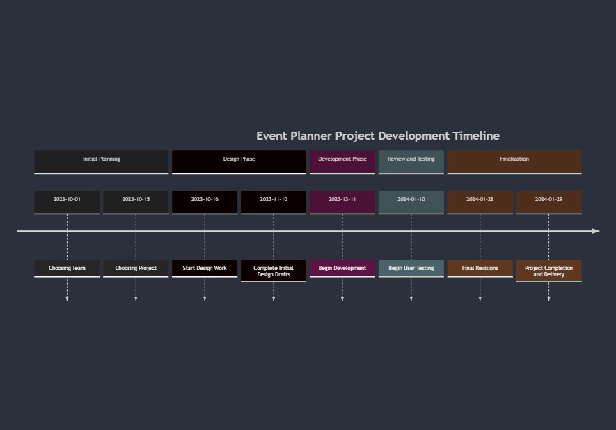

**Software Architecture Report: Eventplanner**

**Date:** February 17, 2024

**Version:** 1

1. **Purpose**

The Eventplanner project aims to be a comprehensive solution for users to create, attend, and manage events effortlessly. It integrates personalized features such as event preferences, weather updates, and a dedicated event calendar.

**Fulfilled Capabilities**

- **Currently Implemented:**
    
    - **User Management (CRUD):** Users can create,read,update,and delete their accounts.
    - **Event Management (CRUD):** Users can create,read,update,and delete events.
    - **Admin/Ownership:** Users can be designated as event admins with the ability to modify event details and potentially manage other users.
    - **Invitations:** Users can send and accept event invitations.
    - **Notifications:** The system generates and allows deletion of notifications (e.g.,for invitations,event updates).
    - **Weather Integration:** Retrieves weather data based on event location.
    

2. **Guides**

- **How to Run the Project Locally (Backend):**
    
    Bash
    
    ```
    #from the main folder
    py .\eventplanner\eventplanner_backend\app\eventplanner_main.py 
    ```
    
- **How to Run the Project Locally (Frontend):**
    
    Bash
    
    ```
    #from the main folder
    npm run .\Client\eventbook\src 
    ```
    

3. **Application entry points**

- **Application Entry Points:** The primary entry point is the`eventplanner_main.py`module within the backend directory.Individual API routers (e.g.,`event_management_router`) serve as entry points for specific functionalities.
- **Data Sources:** Tinydb NO-SQL database
- **Data Inputs:**
    - User inputs provided through frontend forms.
    - Data retrieved from internal database storage (`tinydb inputs`).
    - Data from the external weather API.

4. High level diagrams
    
    

5. **Deployment**

- **Deployment Environment:** Currently,the application is deployed locally for development and testing purposes.

6. **QA Process**

- **QA Strategy:** The QA process currently focuses on functional testing utilizing Python's testing frameworks.Test cases cover core modules like account management.(Consider elaborating on manual testing procedures if you have them).

**Test Suites**

- **Test Coverage:** Existing test modules provide unit-level coverage for features related to account management.(Expand this statement as you create tests for event management,invitations,etc.)

7. **External Dependencies**

- **APIs:** 
    
    - Open-Meteo ([https://open-meteo.com/](https://open-meteo.com/)) provides weather data.
    
- **Libraries:**
	- Backend:
		- pydantic  
		- fastapi  
		- python-multipart  
		- bcrypt  
		- passlib  
		- tinydb  
		- tinydb-serialization  
		- PyJWT  
		- uvicorn  
		- geopy  
		- requests
	- Frontend:
		- react
		- styled 
		- icons-material 
		- material
		- jest-dom 
		- react 
		- user-event
		- jwt-decode 
		- react 
		- react-dom 
		- react-router-dom 
		- react-scripts 
		- react-toastify 
		- web-vitals 
		- webfontloader 
- **Dependency Vulnerabilities:** A proactive strategy for vulnerability assessment and management will be essential as the project progresses.Tools and processes for identifying and addressing potential risks in dependencies will need to be defined.

**Disclaimer**

This report reflects the project's current state. Regular updates will be necessary as development continues. Future work may include: